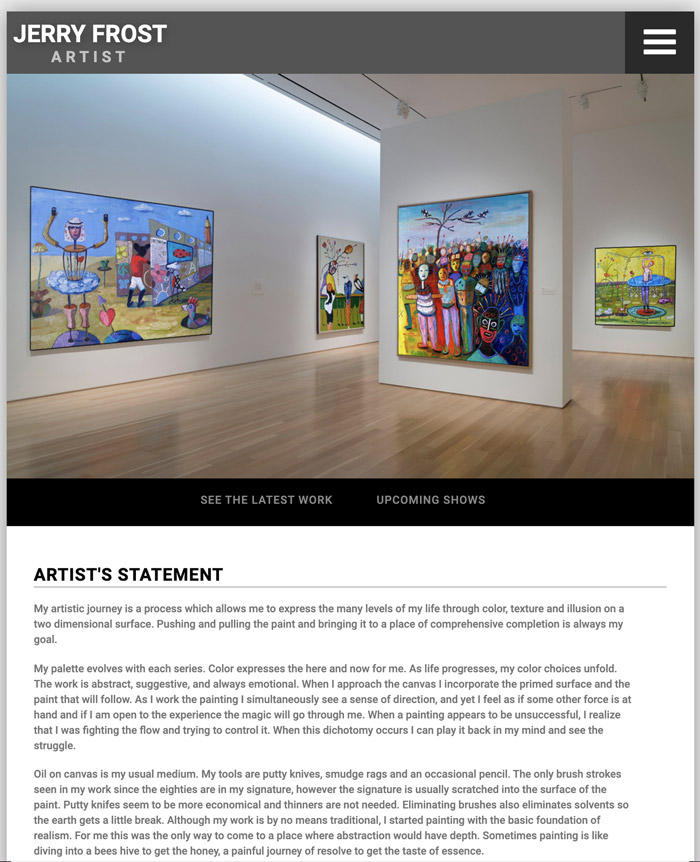

# JerryFrost.com
Artist portfolio website built with PHP and a MySQL database.


# Table of contents
1. [Live Demo](#Live_Demo)
2. [Features](#Features)
3. [Technology](#Technology)
4. [Credits](#Credits)
5. [User Story](#User_Story)

<a name="Live_Demo"></a>
## Live Demo
<a href="https://jerryfrost.com/">Live on JerryFrost.com</a>

<a name="Features"></a>
## Features
1. Artworks organized by category
2. Upcoming show information
3. Admin Dashboard

<a name="Technology"></a>
## Technology
1. PHP
2.  Javascript
3.  MySQL

<a name="Credits"></a>
## Credits
Bart Dority

**on github:** <a href='github.com/b0rgBart3, Kionling'>b0rgBart3</a>


Email: borgBart3@gmail.com
<a name="User_Story"></a>
## User Story
```sh
As an gallery curator or art buyer I want to be able to review Jerry's most recent work, and also to be able to easily review his older work by cateogry.

As an artist, Jerry wants to be able to post information about his latest shows, and his latest works, and to have a running catalog of all of his work.
```

**on github:** <a href='github.com/b0rgBart3'>b0rgBart3</a>

[](https://github.com/remarkablemark)

Email: borgBart3@gmail.com

